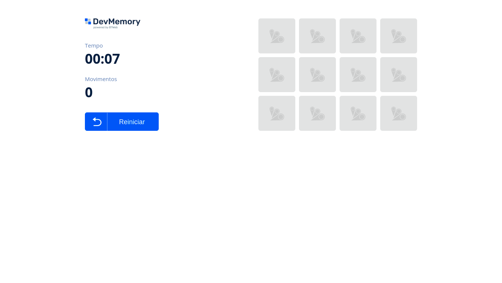

🇧🇷
## Jogo da mémoria
Projeito feito junto com o curso da [B7Web](https://b7web.com.br) com as seguintes tecnologias: 
- [ReactJs](https://reactjs.org/)
- [Styled-Components](https://styled-components.com/)
- [TypeScript](https://www.typescriptlang.org/)

## Instalar 
`npm install`

## Usar 
`npm run dev`

---
🇺🇸

## Memory game

Project made along with the [B7Web] course (https://b7web.com.br) with the following technologies:

- [ReactJs](https://reactjs.org/)
- [Styled-Components](https://styled-components.com/)
- [TypeScript](https://www.typescriptlang.org/)

## Install
`npm install`

## To use
`npm run dev`
